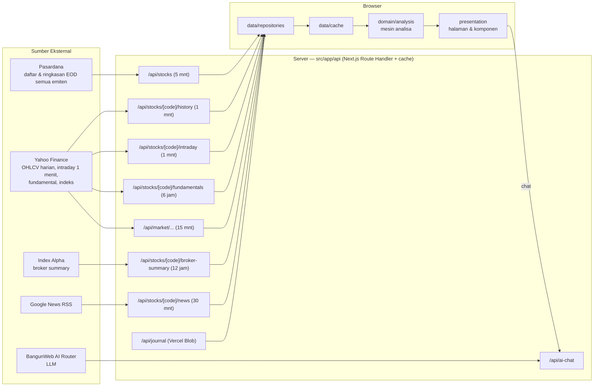
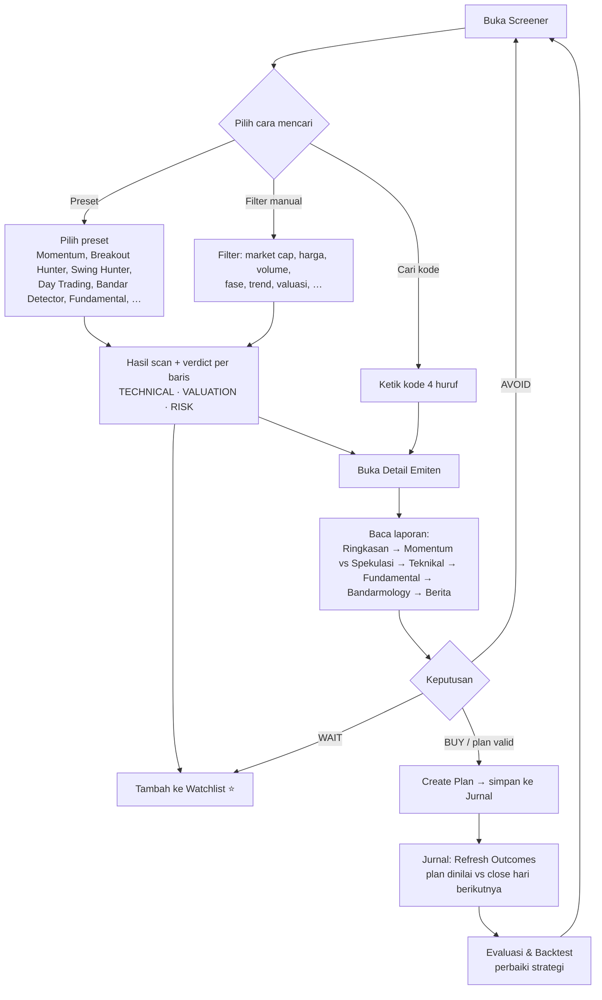
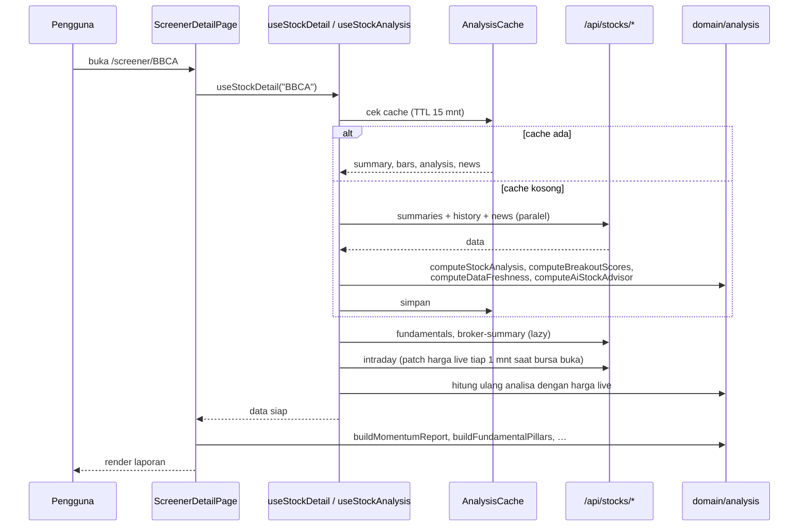
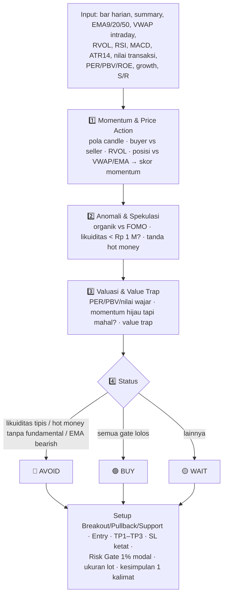
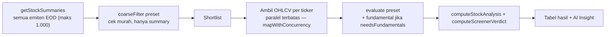
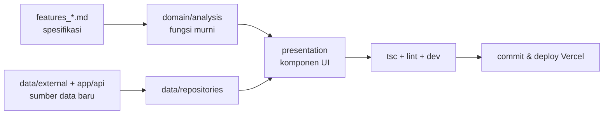

# EzySaham AI — Penjelasan Aplikasi & Workflow

> **Slogan:** *Trade dengan Rencana, Bukan Ekspektasi.*
> Dokumen ini menjelaskan apa itu EzySaham AI, bagaimana data mengalir dari sumber sampai ke layar,
> dan bagaimana pengguna memakainya dari mencari saham sampai mencatat hasil trading.

---

## 1. Ringkasan

EzySaham AI adalah **aplikasi screener & analisa saham Bursa Efek Indonesia (IDX)** berbasis web
(Next.js 16, App Router, React 19, Tailwind 4). Tujuannya membantu trader/investor ritel mengambil
keputusan yang **terukur**: setiap saham dibaca dari sisi teknikal, fundamental, valuasi, dan
bandarmologi, lalu diterjemahkan menjadi **status (BUY / WAIT / AVOID dsb.) + level Entry, TP, SL,
dan Risk Gate**.

Prinsip desain yang dipegang di seluruh kode:

| Prinsip | Artinya di aplikasi |
|---|---|
| **Deterministik** | Semua analisa dihitung dengan rumus/aturan di `src/domain/analysis/*` — input sama, hasil sama. LLM hanya dipakai di AI Chat. |
| **Tidak mengarang data** | Data yang tidak tersedia ditulis `DATA TIDAK TERSEDIA` / `—`, bukan ditebak. |
| **Valid secara matematis** | Plan LONG wajib `SL < Entry < TP1 < TP2 < TP3`; jika tidak → `INVALID PLAN` (lihat `tradingModesReview.ts`, `tradeValidation.ts`). |
| **Harga order = fraksi BEI** | Entry/TP/SL dibulatkan ke tick size IDX (`idxTick.ts`). |
| **Bukan ajakan beli/jual** | Setiap laporan memuat disclaimer edukasi; status "Buy Area" ≠ otomatis BUY. |

---

## 2. Arsitektur

Kode dipisah dalam 4 lapisan (clean architecture sederhana):

```
src/
├── app/                 → Routing Next.js: halaman (page.tsx) & API route (route.ts, server-only)
├── data/                → Akses data
│   ├── external/        → Klien sumber eksternal (Pasardana, Yahoo, Index Alpha) — dipanggil dari API route saja
│   ├── repositories/    → Fungsi fetch dari browser ke /api/* (StockRepository, MarketRepository, Journal, News, Signal)
│   └── cache/           → Cache analisa di memori + sessionStorage (TTL 15 menit)
├── domain/              → Logika bisnis murni (tanpa React, tanpa network)
│   ├── models/          → Tipe data: StockSummary, OHLCVBar, StockAnalysis, Fundamentals, JournalEntry, …
│   ├── indicators/      → EMA/SMA, RSI, MACD, ATR, OBV, VWAP, volume
│   ├── analysis/        → Mesin analisa & keputusan (lihat §5)
│   └── screener/        → Definisi preset screener (presets.ts)
└── presentation/        → UI React per fitur (screener, detail, journal, signal, backtest, terminal, …)
```



**Kenapa lewat API route?** API key (Index Alpha, BangunWeb, Blob) tidak boleh masuk ke bundle browser,
dan route handler memberi cache (`revalidate` + `Cache-Control`) sehingga sumber eksternal tidak dibanjiri request.

### Sumber data & frekuensi cache

| Data | Sumber | Endpoint | Cache |
|---|---|---|---|
| Ringkasan EOD semua emiten (harga, % change 1D–10Y, volume, value, PER, PBV, ROE, market cap, free float, high/low 1Y, sektor) | Pasardana | `/api/stocks` | 5 menit |
| OHLCV harian | Yahoo Finance | `/api/stocks/[code]/history` | 1 menit |
| Bar 1 menit sesi berjalan (VWAP, harga live) | Yahoo Finance | `/api/stocks/[code]/intraday` | 1 menit |
| Fundamental detail (growth, margin, DER, dividen, …) | Yahoo quoteSummary | `/api/stocks/[code]/fundamentals` | 6 jam |
| Broker summary / bandarmologi | Index Alpha | `/api/stocks/[code]/broker-summary` | 12 jam |
| Berita | Google News RSS | `/api/stocks/[code]/news` | 30 menit |
| IHSG & indeks lain | Yahoo Finance | `/api/market/ihsg/history`, `/api/market/index/[key]` | 15 menit |
| Jurnal trading | Vercel Blob (`journal/entries.json`) | `/api/journal` | — |
| AI Chat / research report | BangunWeb AI (OpenAI-compatible) | `/api/ai-chat` | streaming |

> Data harga bersifat **EOD + intraday tertunda**, bukan real-time order book.

---

## 3. Peta Halaman

| Route | Halaman | Fungsi |
|---|---|---|
| `/`, `/screener` | **Screener** | Daftar semua emiten + preset screener, filter, ringkasan pasar (IHSG, top gainer/loser), watchlist |
| `/screener/[ticker]` | **Detail Emiten** | Analisa lengkap satu saham (tab Ringkasan, Chart, Teknikal, Fundamental, Bandarmology, Valuasi, Aksi Korporasi, Berita) |
| `/signal` | **SARA AI Signals** | Dashboard sinyal & kandidat potensi (logika sinyal masih *mock*, harga riil) |
| `/terminal` | **Terminal** | Scan berkala (auto-refresh) dengan status sesi IDX, RVOL, market pulse |
| `/sektor` | **Sektor** | Ringkasan per sektor + daftar saham per sektor |
| `/gainers`, `/losers` | **Movers** | Top 50 gainer / loser hari ini |
| `/compare` | **Compare** | Bandingkan dua ticker berdampingan + AI verdict |
| `/history/[code]` | **Technical History** | Riwayat sinyal teknikal sebuah saham |
| `/backtest`, `/backtest/[code]`, `/backtest/[code]/harian` | **Backtest** | Uji ulang preset/plan terhadap data historis (per hari) |
| `/jurnal` | **Jurnal Trading** | Simpan plan (Entry/TP/SL), lalu nilai hasilnya terhadap close hari berikutnya |
| `/blog`, `/panduan`, `/tutorial`, `/tentang` | Konten | Artikel, glosarium istilah, tutorial, tentang aplikasi |
| (widget global) | **AI Chat** | Tanya-jawab & research report via LLM |

---

## 4. Workflow Pengguna (End-to-End)



### 4.1 Langkah demi langkah

1. **Cek kondisi pasar** — header menampilkan IHSG; panel ringkasan pasar & top gainer/loser
   memberi konteks (regime pasar dibaca oleh `marketRegimeEngine.ts`, dan `tradingPermission.ts`
   menentukan strategi apa yang boleh/hati-hati/diblokir).
2. **Cari kandidat di Screener** — pilih preset atau filter manual. Hasil langsung menampilkan
   verdict ringkas (trend, fase, kualitas, valuasi, risiko) dan AI Insight satu baris.
3. **Simpan ke Watchlist** — disimpan di `localStorage` browser (per perangkat).
4. **Analisa di Detail Emiten** — lihat §6.
5. **Buat rencana trading** — tombol *Create Plan* di header detail menyimpan Entry / TP1 / TP2 / SL,
   R:R, alasan beli & risiko ke Jurnal. Plan yang gagal validasi ditolak.
6. **Eksekusi di sekuritas** — EzySaham **tidak** mengirim order; eksekusi dilakukan manual di aplikasi broker.
7. **Evaluasi** — di `/jurnal`, *Refresh Outcomes* menilai setiap plan terhadap close EOD hari
   berikutnya. Gunakan `/backtest` untuk menguji preset/strategi pada data historis.

---

## 5. Mesin Analisa (`src/domain/analysis`)

Semua file di sini adalah **fungsi murni**. Ringkasnya:

| Kelompok | File | Peran |
|---|---|---|
| **Inti teknikal** | `stockAnalysisEngine.ts` | Dari OHLCV + summary → `StockAnalysis` 7 aspek: Trend & EMA, Support/Resistance, Price Action, Volume (RVOL), Indikator (RSI, MACD, Stoch), Trading Plan bullish/bearish, Kesimpulan |
| | `technicalScore.ts` | Checklist 7 konfirmasi (EMA200/50/9-21, RSI, MACD, Volume) |
| | `marketPhase.ts`, `earlyBullishReview.ts`, `simpleEntryReview.ts`, `entryTiming.ts` | Fase pasar saham (bullish awal, breakout, pullback, extended, distribusi, bearish) & timing entry |
| | `todayMoveAnalysis.ts` | Menjelaskan apa yang berubah hari ini vs close kemarin, dan kenapa |
| **Momentum & spekulasi** | `momentumSpeculation.ts` | Candlestick, RVOL ≥ 1,5x, posisi vs VWAP/EMA 9/20/50, likuiditas (< Rp 1 M), hot money, valuasi vs momentum, plan BUY/WAIT/AVOID + Risk Gate (lihat `features_momentum.md`) |
| **Bandarmologi** | `bandarScore.ts` | Bandar Detector: skor akumulasi/distribusi 100 poin dari price action + volume + OBV (fase Wyckoff) |
| **Fundamental & valuasi** | `fundamentalPillars.ts` | 3 pilar: bisnis, kesehatan (SEHAT/CUKUP/LEMAH), valuasi (UNDERVALUED…OVERVALUED) + nilai wajar & area akumulasi |
| | `fundamentalAcceleration.ts` | Fundamental Change vs Price Lag — apakah bisnis membaik lebih cepat dari harga (kandidat rerating) |
| | `potentialUpside.ts` | Kandidat potensi naik 10/20/25/30% |
| **Keputusan & konsistensi** | `aiStockEngine.ts` | AI Stock Advisor: gabungan fundamental + teknikal + berita + breakout → verdict, confidence, alasan beli/hindari |
| | `tradingModesReview.ts` | Plan per mode: Intraday / Swing / Investing, validasi level & QA validator |
| | `tradeValidation.ts` | Matematika plan yang sadar arah (LONG/SHORT) |
| | `riskGate.ts`, `objectiveConclusion.ts`, `quickDecisionSnapshot.ts` | Lapisan konsistensi: mencegah kesimpulan saling bertentangan, TRADE/WAIT/NO TRADE |
| | `saraDecision.ts` | SARA AI decision — memisahkan "fundamental bagus" dari "layak dibeli sekarang" |
| | `swingSuitability.ts`, `tenSecondReview.ts` | Kelayakan swing & ringkasan 10 detik untuk pemula |
| | `tradingStyleAdjuster.ts` | Menyesuaikan plan dengan preferensi gaya trading (batas CL, TP minimum) |
| **Screener** | `screenerVerdict.ts`, `screenerInsight.ts` | Verdict per baris tabel (versi ringan dari analisa detail) |
| **Pasar** | `marketRegimeEngine.ts`, `tradingPermission.ts` | Regime IHSG & izin strategi |
| **Utilitas** | `idxTick.ts`, `dataFreshness.ts` | Fraksi harga BEI, deteksi data basi |

---

## 6. Workflow Detail Emiten (`/screener/[ticker]`)



**Isi tab:**

| Tab | Isi |
|---|---|
| **Ringkasan** | Technical Summary, AI Insight, laporan **⚡ Momentum vs Spekulasi** (`Trading1MinutesGeminiReport`) |
| **Chart** | Grafik harga interaktif |
| **Teknikal** | Technical Summary + detail indikator & level |
| **Fundamental** | Detail fundamental (growth, margin, DER, ROE, PER, PBV) |
| **Bandarmology** | Bandar Detector + broker activity (Index Alpha) |
| **Valuasi** | Snapshot valuasi & target harga (nilai wajar) |
| **Aksi Korporasi** | Dividen & aksi korporasi |
| **Berita** | Berita terbaru + klasifikasi umur & relevansi |

Panel kanan (sticky): Snapshot, Key Levels, Fundamental, Ownership Flow, Performance, Price Target.

### 6.1 Alur laporan Momentum vs Spekulasi



Syarat **BUY**: harga di area entry, breakout terkonfirmasi RVOL ≥ 1,5x, harga ≥ VWAP,
R:R ≥ 1:1,5, jarak SL ≤ 8%, RSI < 75. Ambang ada di bagian atas `momentumSpeculation.ts`.

---

## 7. Workflow Screener (scan dua tahap)



Setiap preset (`src/domain/screener/presets.ts`) mendefinisikan `coarseFilter` (cepat, tanpa
network) dan `evaluate` (lengkap dengan bar harga). Preset yang tersedia antara lain: ARA, BPJS,
Momentum, Breakout Hunter, Trading Plan, Swing Hunter, ARA Hunter, Early Accumulation,
Bandar Detector, Day Trading, Fundamental, Swing Trend, Swing Momentum, Fundamental Quality,
High Growth, Core Portofolio. Parameter `asOf` membuat preset yang sama bisa diputar ulang di Backtest.

---

## 8. Penyimpanan & Status Fitur

| Hal | Disimpan di | Catatan |
|---|---|---|
| Watchlist | `localStorage` | Per browser/perangkat |
| Cache analisa | Memori + `sessionStorage` | TTL 15 menit, versi cache di-bump saat format berubah |
| Jurnal trading | Vercel Blob (`journal/entries.json`) | Single-user, tulis-ulang penuh setiap perubahan |
| Login | — | Komponen auth ada, tetapi integrasi Supabase masih dinonaktifkan |
| SARA AI Signals | `SignalRepository` | Logika sinyal masih **mock**, harga riil |

### Environment variable

| Variabel | Dipakai untuk |
|---|---|
| `INDEX_ALPHA_API_KEY` | Broker summary (Index Alpha) |
| `BANGUNWEB_APIKEY`, `BANGUNWEB_BASEURL`, `BANGUNWEB_MODEL` | AI Chat |
| `BLOB_READ_WRITE_TOKEN` | Jurnal di Vercel Blob |
| `AUTH_SECRET`, `AUTH_GOOGLE_ID`, `AUTH_GOOGLE_SECRET` | Login Google (next-auth — paket & env tersedia, belum dipakai di kode) |
| `NEXT_PUBLIC_SUPABASE_URL`, `NEXT_PUBLIC_SUPABASE_PUBLISHABLE_KEY` | Supabase (belum aktif) |

---

## 9. Workflow Pengembangan

1. **Spesifikasi fitur** ditulis sebagai `features_*.md` di root repo (mis. `features_momentum.md`,
   `features_rule_engine.md`, `features_riskgate.md`).
2. **Logika** diimplementasikan sebagai fungsi murni di `src/domain/analysis/` — tanpa React & tanpa fetch,
   sehingga bisa dipakai ulang oleh Screener, Detail, Backtest, dan Signal.
3. **Data baru** dari sumber eksternal → tambah klien di `src/data/external/`, expose lewat
   `src/app/api/**/route.ts` (dengan cache), lalu fungsi fetch di `src/data/repositories/`.
4. **Tampilan** di `src/presentation/features/<fitur>/` memakai token tema `.sv-theme` dan
   komponen `ui.tsx` (Card, Badge, PanelTitle, Skeleton).
5. **Cek kualitas:** `npx tsc --noEmit` dan `npm run lint`; jalankan `npm run dev` untuk cek visual.
6. Versi Next.js di project ini (16.x) punya perubahan API — baca `node_modules/next/dist/docs/`
   sebelum menulis kode yang bergantung pada API Next.js (lihat `AGENTS.md`).



---

> ⚠️ **Disclaimer:** EzySaham AI adalah alat bantu analisa & edukasi. Semua status, target, dan level
> adalah hasil perhitungan aturan terhadap data historis/tertunda — bukan prediksi pasti dan bukan
> ajakan membeli atau menjual saham. Keputusan dan risiko sepenuhnya di tangan pengguna.
