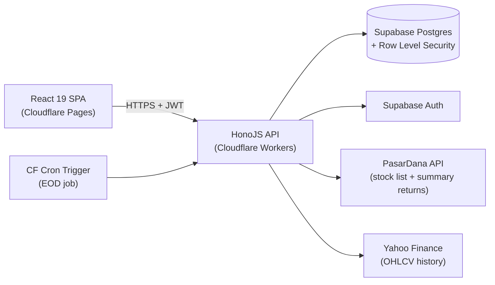

# StockPilot — System Architecture

## System diagram



External data sources are unchanged from today: PasarDana (`https://pasardana.id/api/StockSearchResult/GetAll`, per `src/data/repositories/StockRepository.ts`) for the ~1000-ticker summary list, and Yahoo Finance (per `server/historyRoutes.js`) for OHLCV bars.

## Layering

- **Presentation** (`apps/web/src/presentation`) — React components, Shadcn UI primitives, Framer Motion.
- **Application** (`apps/web/src/application`) — Tanstack Query hooks + React Hook Form, orchestrates calls into Domain/Data.
- **Domain** (`packages/domain`) — pure TypeScript, **zero framework imports**, ported near-unchanged from `src/domain/engine/*` and `src/domain/indicators.ts`. This property (framework-free) already holds true today and must be preserved — it's what makes the engine portable to a Worker at all.
- **Data** (`apps/api/src/routes`, `apps/web/src/data`) — Hono route handlers + Supabase client on the backend; repository-pattern clients on the frontend (preserves the existing `StockRepository`/`HistoryRepository`/`TradeJournalRepository` boundary, just swapping the transport from Express-proxied `fetch` to Hono-proxied `fetch`/direct Supabase queries).

## Frontend Pages (route table)

Mapped from the 28 existing components in `src/presentation/features/screener/*`:

| Route | Page | Legacy component | Status |
|---|---|---|---|
| `/login`, `/signup` | Auth | — | net-new |
| `/` | Dashboard | — | net-new |
| `/screener` | Screener (ARA/BPJS/Momentum presets + filters) | `ScreenerPage.tsx`, `StockCard.tsx`, `StockListView.tsx`, `FilterSidebar.tsx`, `QuickFilterChips.tsx` | rebuilt on `domain/engine/*` output, dropping `scoringEngine.ts` fields |
| `/stock/:ticker` | Stock Detail (AI Engine, Trade Engine, After-Close Score tabs) | `StockDetailPage.tsx`, `AiEngineTab.tsx`, `TradeEngineCard.tsx`, `AfterCloseScoreTab.tsx`, `TradePipelineTab.tsx`, `DetailSummaryTab.tsx` | rebuilt, same underlying engine calls |
| `/watchlist` | Watchlist (personal + AI daily snapshot history) | `WatchlistAiTab.tsx`, `WatchlistSidebar.tsx`, `WatchlistTicker.tsx` | rebuilt + newly persisted |
| `/journal` | Trading Journal | `TradeJournalTab.tsx` | ported, adds close/update flow |
| `/backtest` | Backtest runner + results | — (was `scripts/backtest-momentum-score.ts`, ad hoc) | net-new persisted feature |
| `/checklist` | Checklist templates + completion | — | net-new |
| `/settings` | User profile, trading style, risk profile | — | net-new |

Supporting/shared components carried forward in spirit (not 1:1 code): `HeroSummary.tsx`, `NotificationModal.tsx`, `EmptyState.tsx`, `SkeletonStockCard.tsx`, `ScannerModeTab.tsx` (Swing/Scalping quick views, rebuilt on the unified engine).

## Backend Services (Hono route groups)

| Route group | Purpose | Legacy analog |
|---|---|---|
| `/api/auth/*` | Thin proxy/middleware over Supabase Auth (signup/login/logout/session) | none |
| `/api/stocks`, `/api/stocks/:ticker` | Stock list + detail | `StockRepository.ts` → PasarDana proxy (`server.ts` `/api/stocks`, `api/stocks.js`) |
| `/api/stocks/:ticker/history` | OHLCV bars | `server/historyRoutes.js`, `api/stocks/[code]/history.js` |
| `/api/stocks/:ticker/ai-engine` | `AiEngineOutput` | `aiEngine.ts` (was in-browser only) |
| `/api/stocks/:ticker/trade-engine` | `TradeEngineOutput` | `tradeEngine.ts` (was in-browser only) |
| `/api/watchlist/*` | Personal watchlist CRUD + daily AI snapshot history | net-new (`watchlist_snapshots` table) |
| `/api/journal/*` | `GET/POST/PATCH /journal` | `server/tradeJournalRoutes.js` (`GET/POST` only — `PATCH` is new) |
| `/api/backtest/*` | Run + fetch backtest jobs | net-new |
| `/api/checklist/*` | Templates + results | net-new |

A **scheduled Worker (Cron Trigger)** replaces the on-request freshness check in `server/historyRoutes.js` (which today checks `history_fetch_log.last_fetched_at` per request): it runs once daily after market close to refresh `daily_bars`, then generates and persists that day's `watchlist_snapshots` and `ai_score_history` rows (closing the "computed live, never stored" gap in the legacy app).

## Folder Structure

```
stockpilot/
├── apps/
│   ├── web/                  # React 19 + Vite SPA (Cloudflare Pages)
│   │   └── src/
│   │       ├── presentation/ # pages, components (Shadcn/Tailwind/Framer Motion)
│   │       ├── application/  # Tanstack Query hooks, React Hook Form schemas
│   │       └── data/         # repository clients (Supabase JS / fetch to apps/api)
│   └── api/                  # HonoJS (Cloudflare Workers)
│       └── src/
│           ├── routes/       # route groups per table above
│           ├── middleware/   # auth, error envelope, rate limiting
│           └── jobs/         # Cron Trigger handlers (EOD refresh, snapshot generation)
├── packages/
│   ├── domain/                # ported src/domain/engine/*, indicators.ts, patterns/* — framework-free
│   └── shared-types/           # types shared between apps/web and apps/api
├── supabase/
│   └── migrations/            # SQL migrations (see 03-database-schema.md)
└── docs/stockpilot/            # this documentation suite
```

## State management strategy

**Tanstack Query owns all server state** — replaces the ad hoc `useEffect`+`fetch` and Zustand-backed hooks seen today (`useAiScreener.ts`, `useWatchlistScreener.ts`, `useStockHistory.ts`). This is a real behavior change, not a renaming: caching, retries, and staleness are now framework-managed instead of hand-rolled. Zustand, if retained at all, is scoped to pure client UI state only (open panels, active tab, selected filters) — never server data.

## Auth flow

Supabase Auth (email/password), session via JWT/cookie. Every Hono route that touches user-owned tables validates the Supabase session and relies on Postgres RLS as the actual authorization boundary (see [03-database-schema.md](03-database-schema.md)) — the API layer is not the sole gatekeeper.

## Deployment topology

- **Cloudflare Pages** — static build output of `apps/web`.
- **Cloudflare Workers** — `apps/api` (Hono) + the scheduled Cron job.
- **Supabase project** — Postgres + Auth. Service-role key lives only in Worker secrets, never shipped to the client.
- Environment/secrets: Cloudflare Workers secrets (`wrangler secret put`) for `SUPABASE_SERVICE_ROLE_KEY`; Pages env vars for the public `SUPABASE_URL`/`SUPABASE_ANON_KEY`.

## Cross-cutting concerns

- **Error envelope**: consistent `{ ok: boolean, data?, error?: { code, message } }` shape across all Hono routes (see [04-api-specification.md](04-api-specification.md)).
- **Rate limiting**: external-data-backed routes (`/stocks`, `/stocks/:ticker/history`) rate-limited to avoid hammering PasarDana/Yahoo; cached in `daily_bars`.
- **Caching**: `daily_bars` acts as the cache today (sqlite) and tomorrow (Postgres) — same-day freshness check logic from `server/historyRoutes.js` moves into the Cron job instead of per-request.
- **Observability**: structured logging in Workers (request id, route, duration), surfaced via Cloudflare's log stream/Logpush if needed later.
