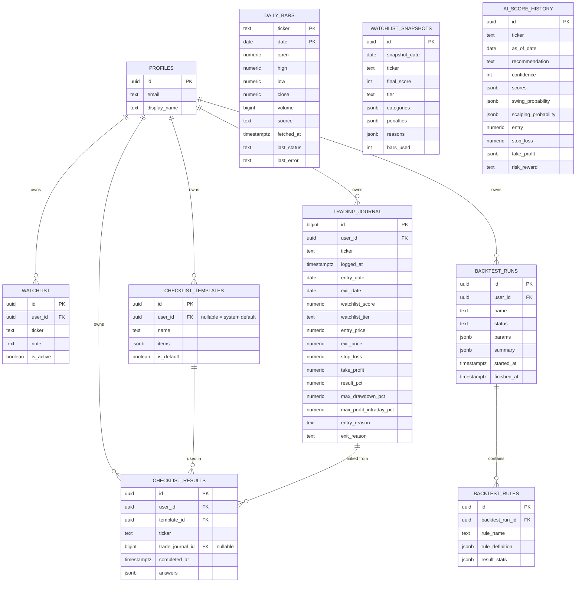

# StockPilot — Database Schema (Supabase Postgres)

## Conventions

- `id uuid primary key default gen_random_uuid()` unless noted otherwise.
- `created_at timestamptz default now()` on every table.
- snake_case naming; foreign keys suffixed `_id`.
- RLS (`alter table ... enable row level security`) enabled on **every** table — the legacy sqlite schema has zero access control (single-user, no auth at all), so every table below is explicitly classified as either **shared reference data** (service-role writes, authenticated-user reads) or **user-owned data** (`auth.uid() = user_id` on every operation).

## ERD

## Table reference

| Table | Purpose | Ownership / RLS |
|---|---|---|
| `profiles` | 1:1 with `auth.users`, auto-created via trigger on signup | own row only: `auth.uid() = id` |
| `watchlist` | user's personally tracked tickers + notes (distinct from the AI-generated daily snapshot) | `auth.uid() = user_id` on all ops |
| `trading_journal` | superset of the legacy sqlite `trade_journal` table (`entry_date`/`exit_date`/`watchlist_score`/`watchlist_tier`/`entry_price`/`exit_price`/`stop_loss`/`take_profit`/`result_pct`/`max_drawdown_pct`/`max_profit_intraday_pct`/`entry_reason`/`exit_reason` — column-for-column match, see `src/domain/models/TradeJournal.ts`), plus `user_id` (legacy has none) | `auth.uid() = user_id` on all ops |
| `daily_bars` | OHLCV cache; **folds the legacy `history_fetch_log` table's columns in** (`last_status`, `last_error`, `fetched_at`) rather than keeping a separate table — one row lookup instead of a join to check freshness (see ADR-003 in [10-glossary-decisions.md](10-glossary-decisions.md)) | shared reference data: `select` for any authenticated user; `insert/update` service-role only (Cron job) |
| `watchlist_snapshots` | **new** — persists the daily After-Market AI ranking (`computeWatchlistOutput` output) that today is computed live in-browser and never stored. Unique `(snapshot_date, ticker)`. | shared: `select` authenticated; `insert` service-role only |
| `ai_score_history` | **new** — historical trail of `AiEngineOutput` per ticker/date, enabling "how did the recommendation change" queries and backtest input. Unique `(ticker, as_of_date)`. | shared: `select` authenticated; `insert` service-role only |
| `backtest_runs` | user-initiated backtest jobs (`status`: `queued`/`running`/`done`/`failed`) | `auth.uid() = user_id` |
| `backtest_rules` | per-rule breakdown within a run (maps to `aistock.md`'s Rule Engine IF/THEN entries + measured hit rate) | via parent: `exists(select 1 from backtest_runs where id = backtest_run_id and user_id = auth.uid())` |
| `checklist_templates` | **new** — `user_id` null = shared system default template, non-null = user's custom template | `select`: own rows OR `user_id is null`; `insert/update/delete`: own rows only |
| `checklist_results` | **new** — completed checklist per ticker, optionally linked to a journal entry | `auth.uid() = user_id` |

## Indexing notes

- `daily_bars`: composite PK `(ticker, date)` already provides the primary access pattern (range scans per ticker).
- `watchlist_snapshots`: unique index `(snapshot_date, ticker)`; a secondary index on `(ticker, snapshot_date desc)` for "history for this ticker" queries; a partial index or view for "latest snapshot per ticker" (`latest_watchlist_snapshots`).
- `ai_score_history`: same pattern, unique `(ticker, as_of_date)`.
- `trading_journal`: index on `(user_id, entry_date desc)` for the journal list view.

## Views

- `latest_ai_scores` — a view over `ai_score_history` selecting the most recent `as_of_date` row per ticker, used by the Stock Detail page to avoid a client-side "pick the max date" query.

## Data migration source (for context, detailed in 06-migration-plan.md)

The legacy sqlite schema (`server/db.js`) has exactly 3 tables — `daily_bars`, `history_fetch_log`, `trade_journal` — which map directly onto `daily_bars` and `trading_journal` above; everything else in this schema (`watchlist`, `watchlist_snapshots`, `ai_score_history`, `backtest_*`, `checklist_*`, `profiles`) is net-new persistence with no legacy source data.
